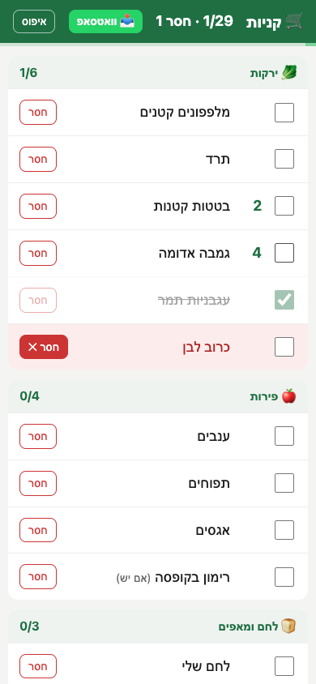

# shopping-list

A skill for [Claude Code](https://claude.com/claude-code) (it also works in Codex). Paste a shopping list and you get a fast, minimal page for your phone, in Hebrew, grouped by store section, with a link you can open in the supermarket.

סקיל שהופך רשימת קניות מודבקת לדף מובייל מינימלי בעברית, מסודר לפי מחלקות בסופר, עם קישור לטלפון.



## What you get

- 🗂️ **Store sections.** Items are grouped into vegetables, fruit, bread, dairy, frozen, dry goods, cleaning and so on, in walking order.
- ✅ **Tap to mark bought.** A bought item is struck through and moves to the bottom of its section. A progress bar shows how far you are.
- ❌ **"חסר" button.** Flags an item the store doesn't have.
- 📤 **WhatsApp export.** Sends the whole list, with each item's status, to any chat.
- 💾 **Saved on the phone.** Marks survive a refresh or closing the tab.
- 🔗 **Temporary public link.** Uses a Cloudflare Quick Tunnel, with no account needed. The link closes itself after two hours.

It's a single static HTML file with no dependencies, no build step and no server-side state.

## Install

```bash
git clone https://github.com/Gal-WPsite/shopping-list.git ~/.claude/skills/shopping-list
# Codex: clone into ~/.codex/skills/shopping-list instead
```

For the phone link, install `cloudflared` (`brew install cloudflared`). It also needs `python3`.

## Use

In Claude Code, paste your list and say something like "תסדר לי רשימת קניות" or "make me a shopping list". Claude sorts the items into sections, builds the page and sends you the link.

To run it by hand:

```bash
python3 scripts/build.py examples/list.json /tmp/shopping-list
scripts/share.sh start /tmp/shopping-list      # prints url=https://....trycloudflare.com
scripts/share.sh stop
```

The list format is `{"category": [[quantity, name, optional note], ...]}`. See [`examples/list.json`](examples/list.json).

## Privacy

Anyone who has the quick-tunnel URL can open the page for as long as the tunnel is running. The page holds only your list. Your ticks stay in your own browser's localStorage and are never sent to a server.

## License

MIT
